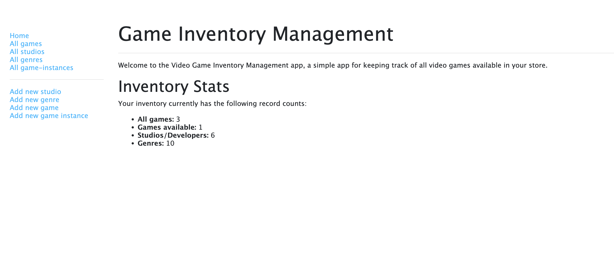
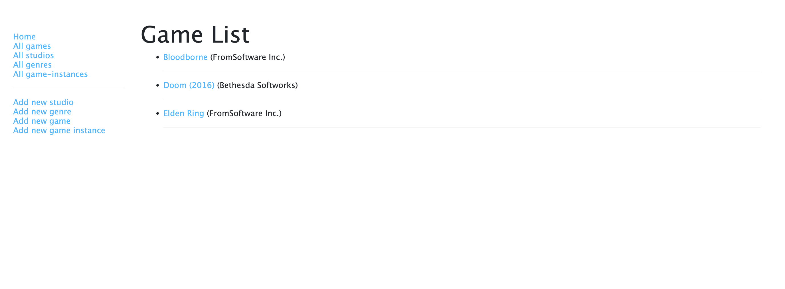
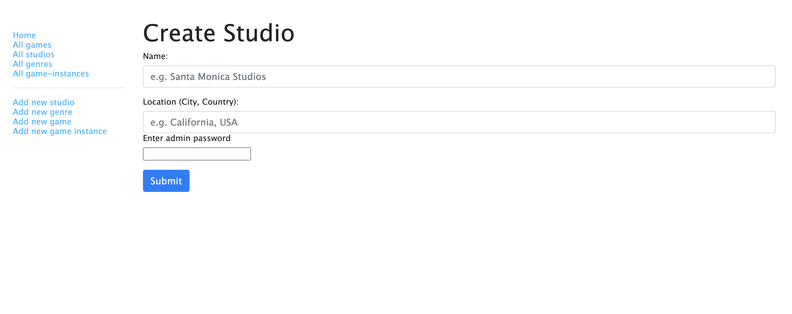

# Game Inventory App

This is a CRUD (Create, Read, Update, Delete) web application for managing a game inventory. The app is built using Node.js and Express.js, and allows users to add new games, studios, genres, and game instances.



# Technologies
 - Express.js (API and routing)
 - Node.js (Server-side hosting and function)
 - MongoDB (Database)
 - Pug (User interface and styling)

# Features
The inventory app shows:

- Game titles in their inventory (**Games**)
- Copies of available games (**Copies available**)
- Game studios/developers (**Studio**)
- All genres (**Genres**)
- Specific routes can only be accessed with a secret password: `adminiscool`



# Getting Started
1. Clone the directory
2. Open the directory in your favorite code editor
3. Run ```DEBUG=inventory-app:* npm run devstart``` in the terminal
4. Go to `localhost:3000/catalog`

To get started with the app, follow these steps:

1. Clone the repository to your local machine
2. Install dependencies using npm install
3. Start the server using `DEBUG=inventory-app:* npm run devstart`
4. Navigate to http://localhost:3000 in your browser

# Usage

Once the server is running, you can use the following endpoints to interact with the app:

- GET /games: Returns a list of all games in the database
- POST /game: Adds a new game to the database
- GET /game/:id: Returns a specific game by ID
- PUT /game/:id: Updates a specific game by ID
- DELETE /game/:id: Deletes a specific game by ID

Similar endpoints exist for studios, genres, and game instances.

# Contributions
If you find any issues or have suggestions for improvements, feel free to open an issue or submit a pull request. Contributions are always welcome!
